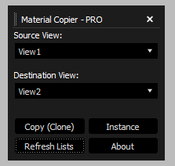

# Material Copier - PRO  (Open Beta) 🚀

Material Copier - PRO for Autodesk 3ds Max 2025+

Developed by: **Iman Shirani**

---

A professional and powerful script for 3ds Max that allows you to quickly copy or instance material nodes between different Views in the Slate Material Editor. This tool is designed for organizing complex scenes and managing materials efficiently.

---
## ✨ Features

* **Smart Copy:** Clones material nodes along with all their dependencies and input maps.
* **Instancing:** Creates instanced copies of nodes, so a change to one affects the other.
* **Automatic View Detection:** Automatically detects all your open Views and displays them in a dropdown list.
* **Dockable UI:** The script window is fully dockable within the 3ds Max environment, allowing you to place it alongside other panels.

---
## ⬇️ Installation

1.  Download the `MaterialCopierPRO.py` file.
2.  In 3ds Max, go to the **Scripting > Run Script** menu and execute the file.
3.  Run `MaterialCopierPRO.py`

---
## 🚀 How to Use

1.  Open the **Slate Material Editor** (M key).
2.  Run the script to launch the tool's window.
3.  From the **Source View** dropdown, select your source view.
4.  From the **Destination View** dropdown, select your target view.
5.  In the source view, **select** the material node(s) you want to copy.
    * **Important Tip:** For the **Copy (Clone)** operation, you only need to select the final output nodes. The script will automatically copy all their input maps.
6.  Press one of the following buttons:
    * **Copy (Clone):** To create a completely new and independent copy.
    * **Instance:** To create a dependent copy that is linked to the original material.

---

🤝 Contributing
Contributions to this project are welcome. If you have an idea for improving the script or have found a bug, please open an Issue on GitHub or submit a Pull Request.

---

📜 License
This project is released under the MIT License. See the LICENSE file for more details.
